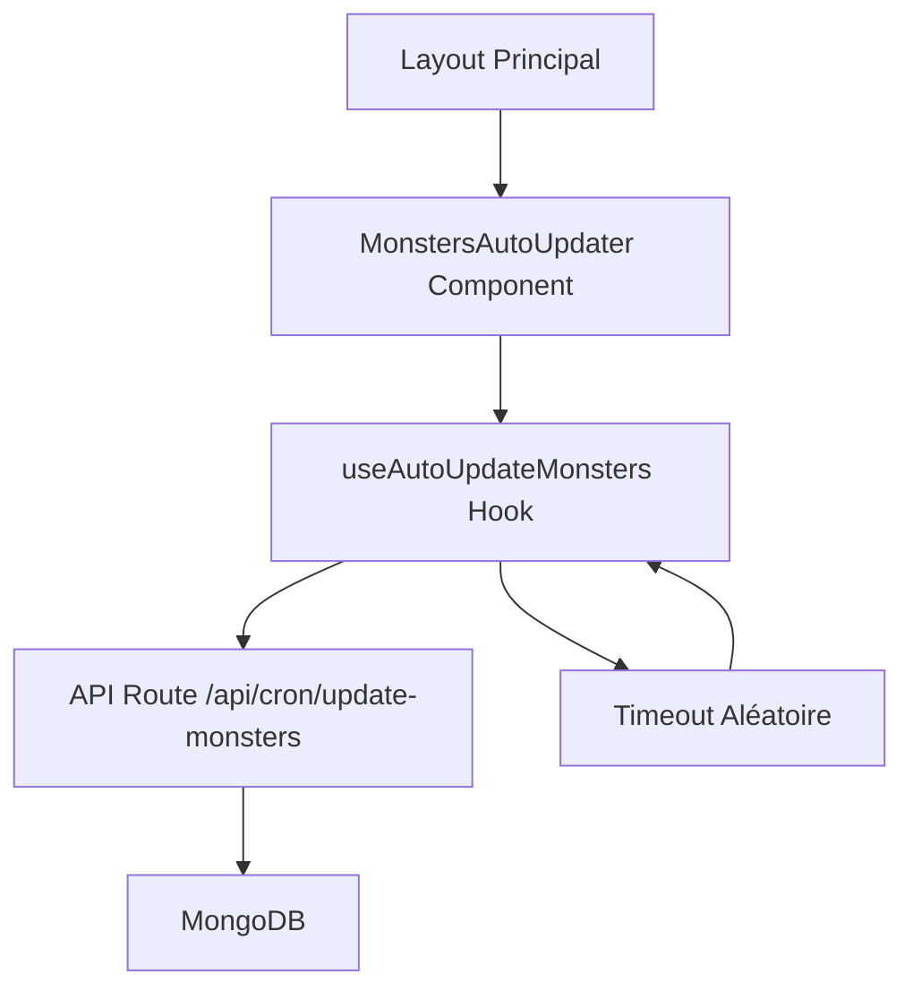

# Système de Mise à Jour Automatique

Le système de mise à jour automatique permet de changer aléatoirement les états des monstres à intervalles réguliers, directement intégré dans l'application Next.js.

## 🎯 Objectif

- Simuler un comportement vivant des monstres
- Mise à jour automatique des états (sad, angry, hungry, sleepy)
- Intervalles aléatoires pour un comportement naturel
- Sans service externe, tout intégré dans Next.js

## 🏗️ Architecture

### Composants principaux

1. **API Route** (`src/app/api/cron/update-monsters/route.ts`)
   - Point d'entrée pour la mise à jour
   - Se connecte à MongoDB
   - Met à jour les états aléatoirement
   - Logs détaillés

2. **Hook React** (`src/hooks/use-auto-update-monsters.ts`)
   - Gère le cycle de vie des mises à jour
   - Calcule les intervalles aléatoires
   - Évite les appels concurrents
   - Retourne l'état et les statistiques

3. **Composant** (`src/components/monsters/auto-updater.tsx`)
   - Wrapper du hook
   - Indicateur visuel optionnel
   - Intégré dans le layout principal

## ✨ Fonctionnalités

- ✅ **Intervalle aléatoire** : Entre 1 et 3 minutes par défaut
- ✅ **Logs détaillés** : Console navigateur + Vercel
- ✅ **Gestion d'erreurs** : Retry automatique
- ✅ **Tracking** : Compteur de mises à jour, temps avant la prochaine
- ✅ **Sécurité optionnelle** : Token d'authentification
- ✅ **Indicateur visuel** : Badge en bas à droite (optionnel)

## 🚀 Avantages

1. **Pas de service externe** : Tout dans Next.js
2. **Gratuit** : Aucun coût supplémentaire
3. **Simple** : Pas de configuration complexe
4. **Flexible** : Intervalle configurable
5. **Compatible Vercel** : Architecture serverless

## 📊 États possibles

Les monstres peuvent avoir les états suivants :

| État | Emoji | Description |
|------|-------|-------------|
| `sad` | 😢 | Triste |
| `angry` | 😠 | En colère |
| `hungry` | 😋 | Affamé |
| `sleepy` | 😴 | Endormi |

## 🔄 Flux de mise à jour

1. **Démarrage** : Le composant `MonstersAutoUpdater` démarre au chargement de l'app
2. **Première mise à jour** : Exécutée immédiatement
3. **Calcul aléatoire** : Un délai entre `minInterval` et `maxInterval` est calculé
4. **Attente** : Le système attend le délai calculé
5. **Mise à jour** : L'API est appelée pour mettre à jour les monstres
6. **Boucle** : Retour à l'étape 3

## 📚 Documentation détaillée

- [Guide de démarrage rapide](./quickstart.md)
- [Configuration avancée](./configuration.md)
- [API Reference](./api-reference.md)
- [Dépannage](./troubleshooting.md)

## 🎓 Prochaines étapes

1. Consultez le [Guide de démarrage rapide](./quickstart.md) pour commencer
2. Explorez la [Configuration avancée](./configuration.md) pour personnaliser
3. Référez-vous au [Dépannage](./troubleshooting.md) en cas de problème

